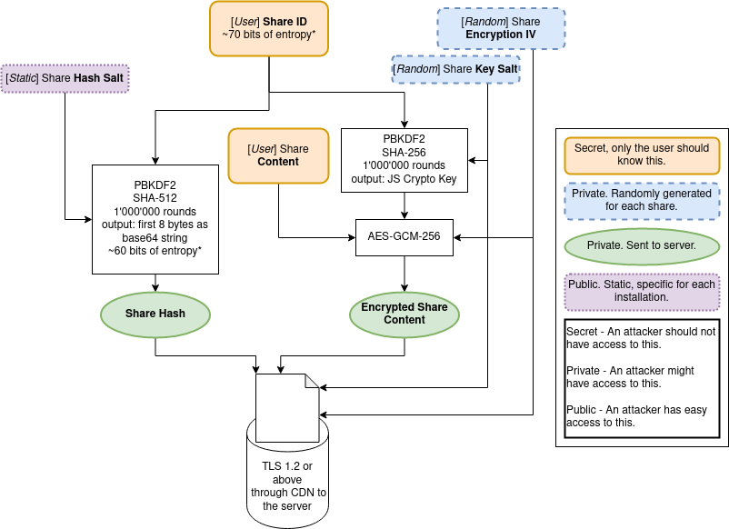

# Encryption

Last Updated: May 31st, 2020.

Important definition in [this document](Definitions).

Read more about what R3 is supposed to defend against in the [Threat Model](ThreadModel) document.

Note that, despite our best efforts, it's impossible to guarantee perfect security. The code might contain bugs and design issues that make it vulnerable to attacks; if you're aware of any please [contact me](https://stefanovazzoler.com/#contact).

## Encryption Overview

When a user creates a Share the site generates `4` pairs of `3` random characters picked from a list of `60` alphanumeric entries (i.e.: `Il2.exa.mpl.ejR`); this is the default Share ID; such Share ID can be modified or regenerated by the user - although the default one gives more than `2e+21` possible entries the user could potentially make it simpler.

We first generate a Share Hash by taking the Share ID and using `1'000` rounds of `PBKDF2` with `SHA-512` and the Hash Salt as salt using `crypto.subtle.deriveBits` to generate a partial hash; we then take `6` chars of the `base64` encoded version (`64^6 = ~6.9e10` possibilities) of such partial hash and hash that again this time using `500'000` rounds of `PBKDF2` with `SHA-512` and the Hash Salt as salt using `crypto.subtle.deriveBits` - this is the Share Hash.

To encrypt the Share Content we first need to generate a Share Key. Such Share Key is generated by taking the Share ID, applying `800'000` rounds of `PBKDF2` with `SHA-256` and adding a randomly generated Key Salt. We then take the Share Content and encrypt it using `AES-GCM-256`, the Share Key, and a randomly generated Encryption IV - this will produce the Encrypted Share Content.

The generated Share Hash, Encrypted Share Content, Encryption IV, Key Salt, Expiration Time, and Expiration Views are then sent to the server over a `TLS 1.2` or better connection before being stored in a Redis database.

When a user views a link (i.e.: goes to `https://rkt.one/#Il2.exa.mpl.ejR`), the same process above is done in reverse.

We first generate a Share Hash by taking the Share ID and applying the same process described above. We use the Share Hash to retrieve the Encrypted Share Content, Encryption IV, and Key Salt from the server if the Share has not expired.

We then generate the Share Key similarly to above but instead of using a randomly generated Key Salt we use the server-provided one and then proceed with the decryption of the Encrypted Share Content using the server-provided Encryption IV and the Share Key we just generated; after using `AES-GCM-256` for decryption we perform some basic checks on the Share Content to make sure it confirms to what we expect and prompt the user to request if they trust the Share and the person who sent them the link. After the user accepts the share we will try to securely load the content in the browser.

All the hashing, encryption, and checking mentioned above is performed in-browser client-side. The Share ID, Share Key, or partial hash is never sent to the server.

No external libraries are used for the encryption - and at the time of writing this document no 3rd party code and/or libraries are used in the client at all.

## Diagrams

**Encryption**

[View PNG](img/R3_encrypt_diagram.png) - [View SVG](img/R3_encrypt_diagram.svg)
